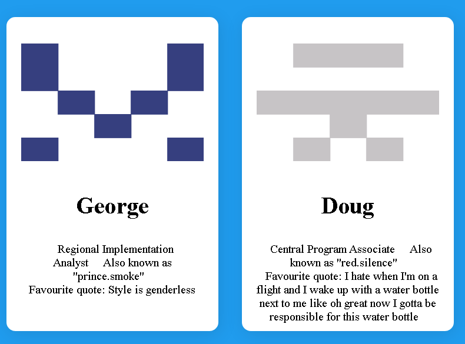
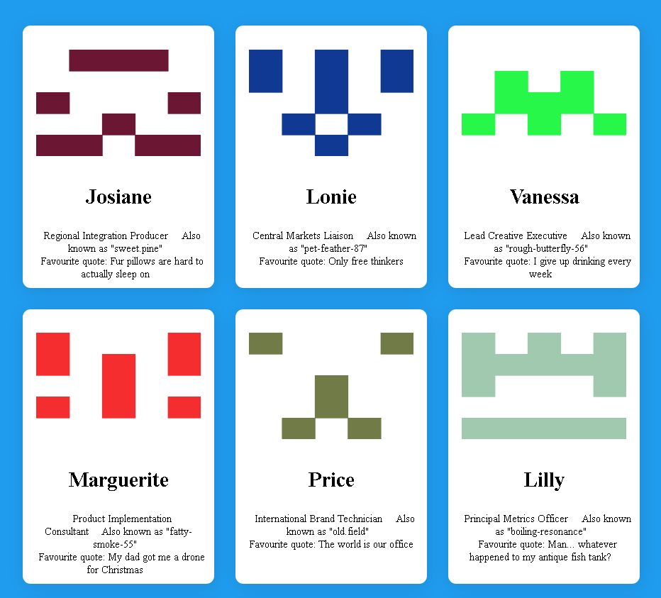

# Proiect Cloud
## Introducere
Aplicatia prezentata ofera posibilitatea de a avea diferite profiluri pentru diferite instante
## Descrierea problemei
Aplicatia pe care am creat-o prezinta ccrearea total aleatorie a mai multor profiluri pentru diferite persoane.
Fiecare persoana are:
* un nume
* o poza de profil
* un rol intr-o companie
* o porecla
* un citat favorit

Astfel se creaza profiluri aleatorii la fiecare refresh al paginii.

Exemplu1:


Exemplu2 (dupa reactualizarea paginii):


## Prezentarea API-urilor utilizate

Pentru aceasta aplicatie am integrat 3 api-uri din lista data(https://github.com/public-apis/public-apis):

* FakeJSON (API care ofera posibilitatea de a optine fisiere de tip json cu numele, meseriile si ocupatiile entitatilor noastre pe baza unui token, fiecare token avand informatii diferite)
* Identicon (API care configureaza avatarurile entitatilor noastre in mod aleatoriu)
* kanye.rest (API care genereaza in mod aleatoriu citatele entitatilor noaste)

## Descrirea arhitecturii

Pentru a face request-uri API-urilor mentionate, se utilizeaza atat operatii asincrone, cat si sincrone de tip ```XMLHttpRequest()```

Cele trei butoane (```Token1```, ```Token2```, ```Token3```) au rolul de a selecta unul din token-urile oferite de FakeJSON API (cate un cod pentru fiecare utilizator, insa fiecare cod permite doar 1000 de get-uri/post-uri in fiecare zi)

Preluarea de date din FakeJSON si Identicon se face in mod asincron (atat operatiunile de tip ```POST``` cat si cele de tip ```GET```)

Operatiunile cu date din API-uri cu citate se face in mod sincron, pentru fiecare numar de entitati in parte.

Exemplu de format json pentru comunicarea cu API-ul FakeJSON:
```json
{
"token": """,
    "data": {
	"nameFirst": "nameFirst",
	"personAvatar": "personAvatar",
	"jobTitle": "personTitle",
	"nickName": "personNickname"
	}
}
```

## Flux de date

* Aplicatia prezinta cele trei butoane, ```Token1```, ```Token2```, ```Token3``` (in functie de butonul selectat se alege token-ul pentru datele din FakeJSON)


* Dupa ce se selecteaza unul dintre butoane, se incarca profilurile entitatilor noastre



* Pentru a selecta alt token, pagina trebuie reactualizata (refresh) si se selecteaza alt token


## Referinte
* https://fakejson.com/
* https://kanye.rest/
* https://www.kwelo.com/media/identicon/